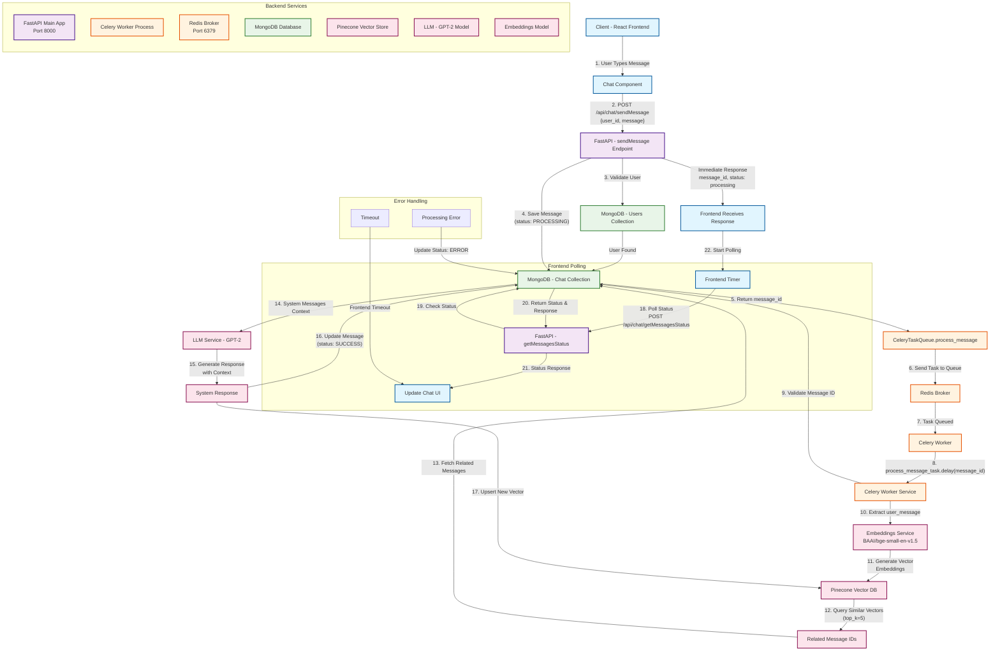

# SendMessage API Flow Diagram

## Flow Description

### 1. User Interaction (Frontend)
- User types message in React chat component
- Frontend calls `POST /api/chat/sendMessage` with user_id and message

### 2. API Processing (FastAPI)
- **Endpoint**: `/api/chat/sendMessage`
- **Validation**: Check if user exists in Users collection
- **Storage**: Save message to Chat collection with status "PROCESSING"
- **Queue**: Send task to Celery via Redis broker
- **Response**: Return message_id and processing status immediately

### 3. Background Processing (Celery Worker)
- **Task**: `process_message_task.delay(message_id)`
- **Validation**: Verify message exists in database
- **Embeddings**: Generate vector using BAAI/bge-small-en-v1.5 model
- **Similarity Search**: Query Pinecone for top 5 similar vectors
- **Context Retrieval**: Fetch related messages from MongoDB
- **LLM Generation**: Generate response using GPT-2 with context
- **Update**: Save response to database and update status
- **Vector Storage**: Store new vector in Pinecone for future similarity searches

### 4. Status Polling (Frontend)
- **Polling**: Frontend polls `POST /api/chat/getMessagesStatus` every 10 seconds
- **Status Check**: Backend checks message status in database
- **UI Update**: Frontend updates chat interface when response is ready

### 5. Error Handling
- **Processing Errors**: Update message status to ERROR in database
- **Timeout**: Frontend stops polling after maximum retries
- **Graceful Degradation**: System continues to work even if some components fail

## Key Components

- **Frontend**: React.js with axios for API calls
- **API**: FastAPI with async/await support
- **Queue**: Redis as message broker
- **Worker**: Celery for background task processing
- **Database**: MongoDB for persistent storage
- **Vector DB**: Pinecone for similarity search
- **ML Models**: GPT-2 for response generation, BGE embeddings for vectors 